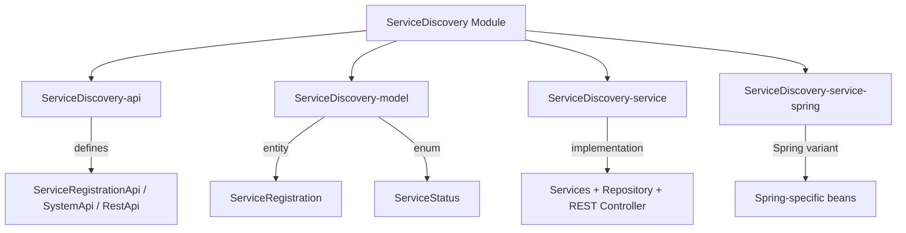
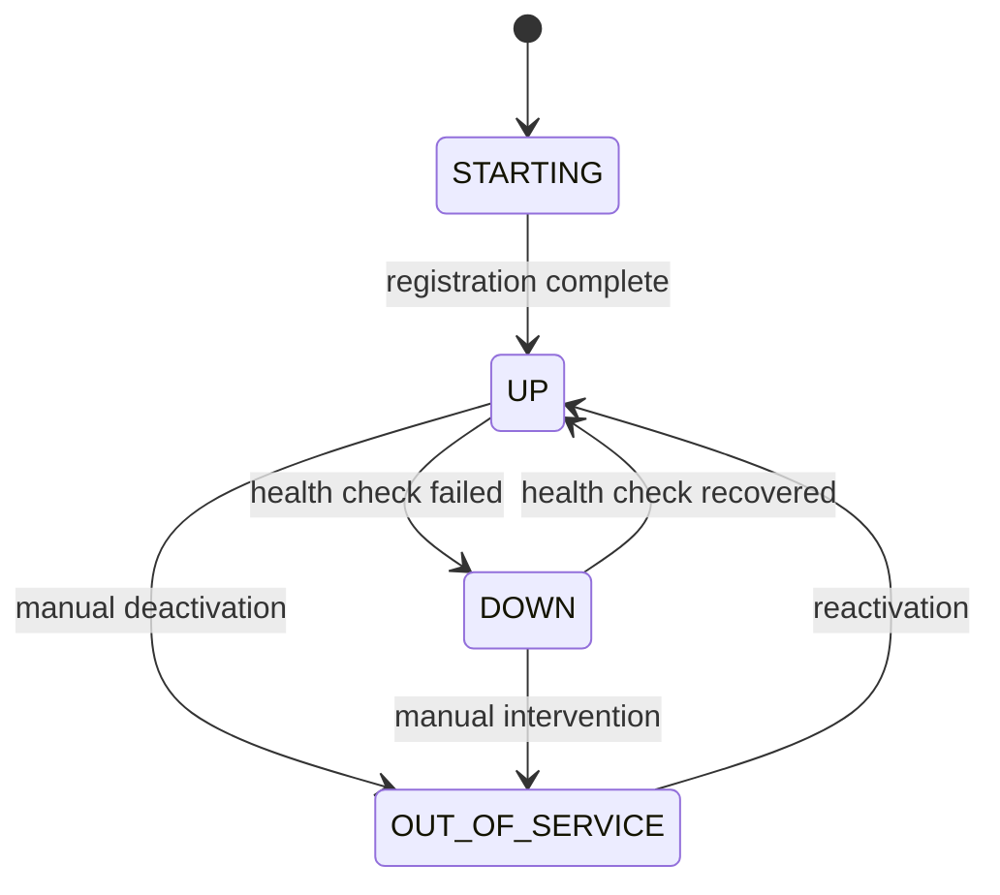

# ServiceDiscovery Module

The **ServiceDiscovery** module provides a service registration and discovery system for the Water Framework. It enables microservices to register themselves, perform health checks, send heartbeats, and discover other available services in a distributed environment.

## Architecture Overview



## Sub-modules

| Sub-module | Description |
|---|---|
| **ServiceDiscovery-api** | Defines `ServiceRegistrationApi`, `ServiceRegistrationSystemApi`, `ServiceRegistrationRestApi`, `ConfigManager`, and `ConfigChangeListener` interfaces |
| **ServiceDiscovery-model** | Contains the `ServiceRegistration` JPA entity, `ServiceStatus` enum, and custom `ServiceDiscoveryActions` |
| **ServiceDiscovery-service** | Default implementation of services, repository, REST controller, and in-memory `ConfigManager` |
| **ServiceDiscovery-service-spring** | Spring-specific service registration |

## ServiceRegistration Entity

```java
@Entity
@Table(name = "service_registration",
       uniqueConstraints = @UniqueConstraint(columnNames = {"serviceName", "instanceId"}))
@AccessControl(availableActions = { CrudActions.class, ServiceDiscoveryActions.class },
    rolesPermissions = {
        @DefaultRoleAccess(roleName = "serviceDiscoveryManager", actions = { "save","update","find","find_all","remove","health_check" }),
        @DefaultRoleAccess(roleName = "serviceDiscoveryViewer", actions = { "find", "find_all" }),
        @DefaultRoleAccess(roleName = "serviceDiscoveryOperator", actions = { "find","find_all","health_check" })
    })
public class ServiceRegistration extends AbstractJpaEntity implements ProtectedEntity, OwnedResource {
    // ...
}
```

### Entity Fields

| Field | Type | Constraints | Description |
|---|---|---|---|
| `serviceName` | String | `@NotNull`, unique (composite) | Name of the registered service |
| `serviceVersion` | String | — | Version identifier |
| `instanceId` | String | `@NotNull`, unique (composite) | Unique instance identifier |
| `endpoint` | String | `@NotNull` | Service endpoint URL |
| `protocol` | String | — | Communication protocol (HTTP, gRPC, etc.) |
| `description` | String | — | Human-readable description |
| `tags` | Set\<String\> | — | Tags for discovery filtering |
| `metadata` | Map\<String, String\> | — | Arbitrary key-value metadata |
| `status` | ServiceStatus | — | Current service status |
| `lastHeartbeat` | LocalDateTime | — | Last heartbeat timestamp |
| `healthCheckInterval` | Integer | — | Health check interval in seconds |
| `healthCheckEndpoint` | String | — | Health check URL path |
| `configuration` | String | — | Service configuration data |
| `ownerUserId` | Long | — | Owner user ID |

### Service Status Lifecycle



## API Interfaces

### ServiceRegistrationApi (Public — with permission checks)

| Method | Description |
|---|---|
| `register(ServiceRegistration)` | Register a new service instance |
| `deregister(String serviceName, String instanceId)` | Remove a service registration |
| `findByServiceName(String)` | Find services by name |
| `findByTags(Set<String>)` | Find services by tags |
| `findByStatus(ServiceStatus)` | Find services by status |
| `getAvailableServices()` | Get all services with status `UP` |
| `updateHeartbeat(String serviceName, String instanceId)` | Update heartbeat timestamp |
| `performHealthCheck(String serviceName, String instanceId)` | Execute a health check |

### ServiceRegistrationSystemApi (System — no permission checks)

| Method | Description |
|---|---|
| `registerInternal(ServiceRegistration)` | Internal registration (no auth required) |
| `performBatchHealthCheck()` | Health check all registered services |
| `cleanupInactiveServices(int thresholdSeconds)` | Remove services that missed heartbeats |
| `findByCustomQuery(Query)` | Custom query-based search |
| `updateStatus(String serviceName, String instanceId, ServiceStatus)` | Update service status directly |

### REST Endpoints

| HTTP Method | Path | Action |
|---|---|---|
| `POST` | `/water/services` | Register a service |
| `DELETE` | `/water/services/{name}/{instanceId}` | Deregister a service |
| `GET` | `/water/services?name={name}` | Find by service name |
| `GET` | `/water/services?status={status}` | Find by status |
| `GET` | `/water/services/available` | Get all available (UP) services |
| `PUT` | `/water/services/{name}/{instanceId}/heartbeat` | Update heartbeat |
| `POST` | `/water/services/{name}/{instanceId}/health` | Perform health check |

## Default Roles

| Role | Permissions |
|---|---|
| **serviceDiscoveryManager** | `save`, `update`, `find`, `find_all`, `remove`, `health_check` |
| **serviceDiscoveryViewer** | `find`, `find_all` |
| **serviceDiscoveryOperator** | `find`, `find_all`, `health_check` |

## Configuration

The module includes a `ConfigManager` interface with a default `InMemoryConfigManager` implementation for managing service discovery configuration at runtime. Implement `ConfigChangeListener` to react to configuration changes.

## Usage Example

```java
// Register a service
@Inject
private ServiceRegistrationApi serviceRegistrationApi;

ServiceRegistration registration = new ServiceRegistration();
registration.setServiceName("payment-service");
registration.setServiceVersion("1.0.0");
registration.setInstanceId("payment-01");
registration.setEndpoint("http://payment-01:8080");
registration.setProtocol("HTTP");
registration.setStatus(ServiceStatus.UP);
registration.setHealthCheckEndpoint("/health");
registration.setHealthCheckInterval(30);

serviceRegistrationApi.register(registration);

// Discover available services
Collection<ServiceRegistration> available = serviceRegistrationApi.getAvailableServices();

// Heartbeat
serviceRegistrationApi.updateHeartbeat("payment-service", "payment-01");

// Cleanup stale services (system-level)
@Inject
private ServiceRegistrationSystemApi systemApi;
systemApi.cleanupInactiveServices(120); // 2 minutes threshold
```

## Dependencies

- **Core-api** — Base interfaces and annotations
- **Core-model** — `AbstractJpaEntity`, `ProtectedEntity`, `OwnedResource`
- **Core-security** — `@AccessControl`, `@DefaultRoleAccess`
- **Repository / JpaRepository** — Persistence layer
- **Rest** — REST controller infrastructure
